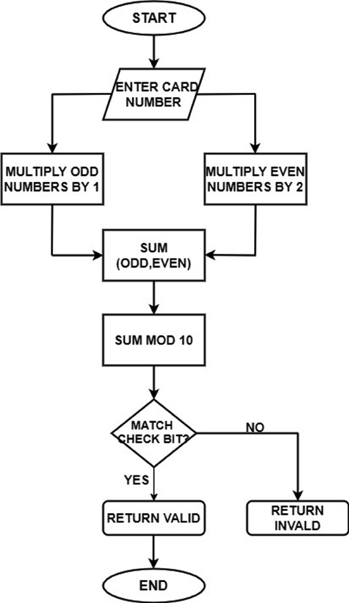

# Credit Card Validation Web Server Documentation

### Overview
This Go web server validates credit card numbers using Luhn's Algorithm. The server exposes an endpoint to which users can POST a card number to check its validity. 

### Table of Contents
1. [Installation](#installation)
2. [Usage](#usage)
3. [API Endpoints](#api-endpoints)
4. [Luhn's Algorithm](#luhns-algorithm)
5. [Example Requests](#example-requests)

### Installation
To run this server, ensure you have Go installed. Clone the repository and run the following commands to start the server:

```bash
git clone <repository-url>
cd <repository-directory>
go run main.go
```

### Usage
Start the server by running `go run main.go`. The server will listen on port 8080.

### API Endpoints

#### POST `/`
Validates a credit card number.

- **Request Body**: JSON object containing the card number.
    ```json
    {
        "cardNumber": "4111111111111111"
    }
    ```
- **Response**: JSON object indicating whether the card number is valid or not.
    - Success Response (Valid card number):
        ```json
        {
            "message": "Valid card number"
        }
        ```
    - Failure Response (Invalid card number):
        ```json
        {
            "message": "Invalid card number"
        }
        ```
    - Error Response (Malformed request):
        ```json
        {
            "error": "Invalid request format"
        }
        ```

#### GET `/health`
Checks the health of the server.

- **Response**: A plain text response indicating the server is running.
    ```
    OK
    ```

### Luhn's Algorithm
Luhn's Algorithm is used to validate the credit card number. The steps involved in the algorithm are:

1. Starting from the rightmost digit, double the value of every second digit.
2. If doubling a number results in a number greater than 9, subtract 9 from the result.
3. Sum all the digits.
4. If the total modulo 10 is equal to 0, the number is valid; otherwise, it is not.





### Example Requests

#### Valid Card Number
```bash
curl -X POST -H "Content-Type: application/json" -d '{"cardNumber":"4111111111111111"}' http://localhost:8080/
```

**Response**:
```json
{
    "message": "Valid card number"
}
```

#### Invalid Card Number
```bash
curl -X POST -H "Content-Type: application/json" -d '{"cardNumber":"1234567812345670"}' http://localhost:8080/
```

**Response**:
```json
{
    "message": "Invalid card number"
}
```

### Code Explanation

#### CardHandler Struct
This struct defines the handler for card validation requests.

```go
type CardHandler struct {}
```

#### Validate Method
This method decodes the request body, validates the card number using Luhn's Algorithm, and returns the result.

```go
func (c CardHandler) Validate(w http.ResponseWriter, r *http.Request) {
    var card Card
    err := json.NewDecoder(r.Body).Decode(&card)
    if err != nil {
        http.Error(w, err.Error(), http.StatusBadRequest)
        return
    }

    isValid := ValidateCard(card)
    response := make(map[string]string)
    if !isValid {
        response["message"] = "Invalid card number"
    } else {
        response["message"] = "Valid card number"
    }

    w.Header().Set("Content-Type", "application/json")
    err = json.NewEncoder(w).Encode(response)
    if err != nil {
        http.Error(w, "Internal error", http.StatusInternalServerError)
        return
    }
}
```

#### Main Function
Sets up the router, middleware, and routes, then starts the server.

```go
func main() {
    r := chi.NewRouter()
    r.Use(middleware.Logger)
    handler := CardHandler{}
    r.Post("/", handler.Validate)
    r.Get("/health", func(w http.ResponseWriter, r *http.Request) {
        w.Write([]byte("OK"))
    })
    http.ListenAndServe(":8080", r)
}
```

### Additional Information
- Ensure that your JSON request body contains the correct field name `cardNumber`.
- This example assumes the `ValidateCard` function and `Card` struct are correctly implemented to check the card number using Luhn's Algorithm.

